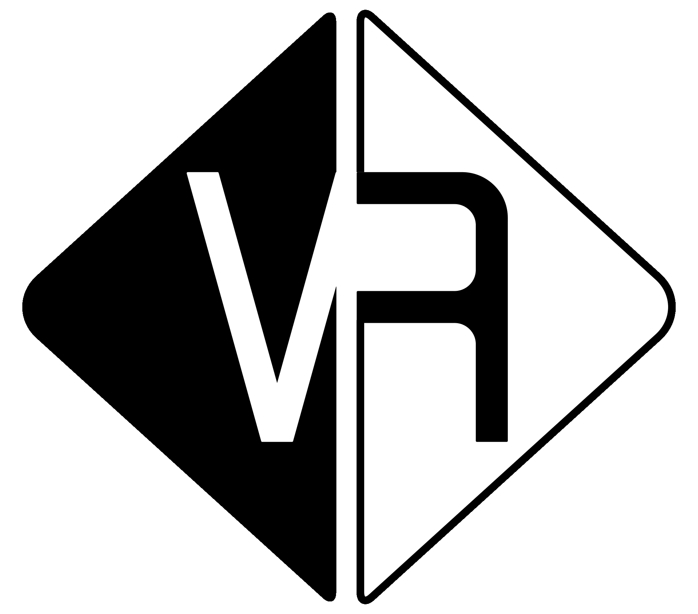
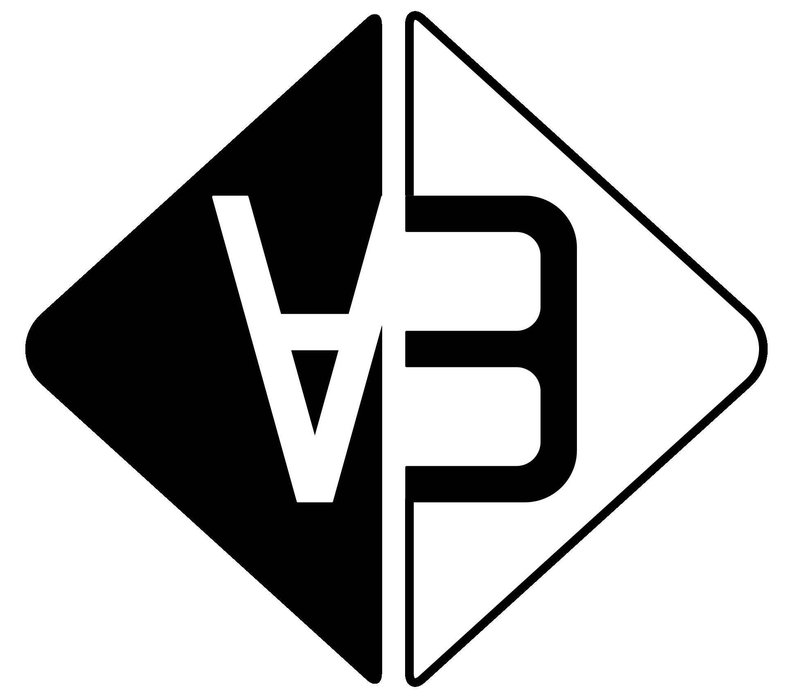
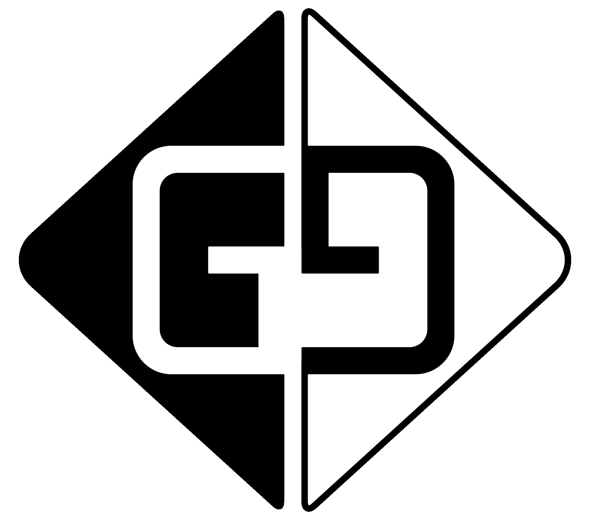
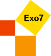

Logique
============================================

Livre & vidéos
==============

* Vous pouvez télécharger le livre sur ce site : [Livre 'Logique' (pdf)](livre-logic.pdf).
* Des vidéos seront prochainement disponibles !

Chapitres
=========

Partie I - Logique vrai/faux
-----------------------------

* [Logique vrai/faux](vraifaux/vraifaux.pdf)
* [Preuves](preuves/preuves.pdf)
* [Quels connecteurs sont utiles ?](connecteurs/connecteurs.pdf)
* [Théorème de compacité](compacite/compacite.pdf)

Partie II - Logique du premier ordre
-------------------------------------

* [Logique du premier ordre](premierordre/premierordre.pdf)
* [Variables et structures](variables/variables.pdf)
* [Satisfaction](satisfaction/satisfaction.pdf)
* [Preuves](preuvesbis/preuvesbis.pdf)
* [Théorème de validité](validite/validite.pdf)
* [Théorème de complétude](completude/completude.pdf)
* [Preuve du théorème de complétude](completudebis/completudebis.pdf)

Partie III - L'incomplétude de Gödel
--------------------------------------

* [Un aperçu de l'incomplétude de Gödel](incompletudeintro/incompletudeintro.pdf)
* [Arithmétique de Peano](peano/peano.pdf)
* [Codage de Gödel](codagegodel/codagegodel.pdf)
* [Fonctions récursives primitives](recursives/recursives.pdf)
* [Fonctions représentables](representables/representables.pdf)
* [Diagonalisation](diagonalisation/diagonalisation.pdf)
* [Preuve du théorème d'incomplétude](incompletudepreuve/incompletudepreuve.pdf)
* [Le second théorème d'incomplétude](incompletudesecond/incompletudesecond.pdf)

Sources
=======

Vous trouverez les fichiers sources en naviguant dans les répertoires de [GitHub "Logique"](https://github.com/exo7math/logique-exo7).

Erreurs
=======

Merci de signaler toutes les éventuelles fautes (de logique, de mathématiques, d'orthographe).

Auteur
======

Arnaud Bodin

Je remercie Stéphanie Bodin et Michel Bodin pour leurs relectures.

Ce livre est diffusé sous la licence *Creative Commons -- BY-NC-SA -- 4.0 FR*.

